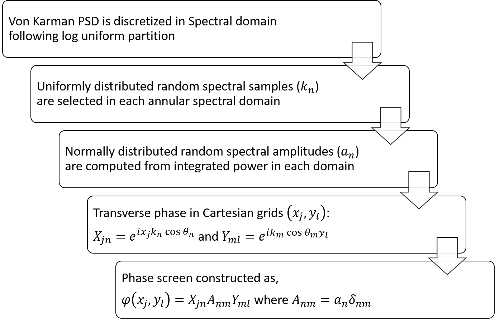
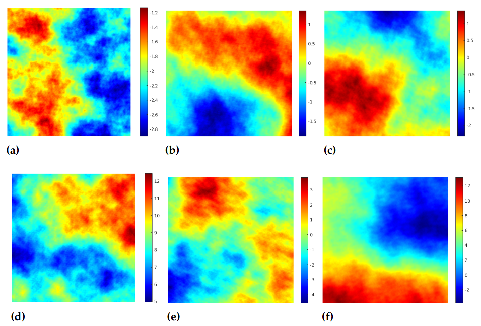

# Tiled Aperture Coherent Beam Combining (TACBC)

## Description

TACBC is a Python library for simulating tiled aperture coherent beam combining. It includes modules for common imports, core functionality, and utility functions to facilitate simulation and analysis.

## Installation

To install the TACBC library, clone the repository and install the required dependencies using:

```bash
git clone https://github.com/Vishwanath1999/tac_lib.git
cd tac_lib
pip install -r requirements.txt
```

## Main Scripts

### main.py

The `main.py` script is used to simulate the Tiled Aperture Coherent Beam Combining (TACBC) with only longitudinal phase noise. It uses the `TiledApertureBeamPropFast` class from the `tac` module from tac_lib. The script sets up the simulation parameters such as the number of channels, image size, and aperture size. It then calculates the amplitude vector and phase noise. The script also initializes the control voltage and transverse phase noise. The far-field distance and bucket size are calculated and used to create an instance of the `TiledApertureBeamPropFast` class. The script then simulates the TACBC and calculates the Power In Bucket (PIB) for the ideal case.

### main2.py

The `main2.py` script is similar to `main.py` but it simulates the TACBC with both longitudinal phase noise and turbulence. It uses the `TiledApertureBeamProp` class from the `tac` module. 

In addition to the steps performed in `main.py`, this script also calculates the number of screens for turbulence simulation and generates atmospheric turbulence screens using the sparse spectrum method. The sparse spectrum method is a technique for generating turbulence phase screens that are statistically similar to those produced by the Kolmogorov spectrum. It is computationally efficient and suitable for large-scale simulations.

The script then simulates the TACBC with turbulence and calculates the PIB for the ideal case. It also generates a subplot of two images of the input and output intensities.

## Turbulence Simulation

*Figure 1: Flowchart of the Sparse Spectrum Method for Turbulence Simulation*

The turbulence simulation in `main2.py` uses the sparse spectrum method to generate atmospheric turbulence screens. The sparse spectrum method is a technique for generating turbulence phase screens that are statistically similar to those produced by the Kolmogorov spectrum. It is computationally efficient and suitable for large-scale simulations.


*Figure 2: Atmospheric Turbulence Screens Generated Using the Sparse Spectrum Method*

## Common Parameters for `main.py` and `main2.py`

Both scripts share a set of common parameters:

- `n_channel`: Number of channels
- `n_img`: Number of iterations
- `im_size`: Image size
- `pix_size`: Pixel size
- `d`: Center to center distance between beams
- `a`: Aperture size
- `fs`: Frequency
- `delt`: Delta
- `cyc`: Cycle
- `t`: Time
- `L`: Length
- `amp_v`, `g_amp`: Amplitude variables
- `noise_env`: Noise environment
- `p_n`: Phase noise
- `V`: Control Voltage initialization
- `Kvar`: Variable K
- `trans_pn`: Transmitted phase noise
- `w_l`: Wavelength
- `k`: Wave number
- `Z`, `r`: Far field distance and bucket size
- `rp`: Rounded bucket size
- `theta`: Angle
- `x`, `y`: Coordinates
- `run`: Run mode
- `pib_val`: Power In Bucket value
- `f_loop`: Loop frequency
- `f_ctrl`: Control rate

## Additional Parameters in `main2.py`

The `main2.py` script has additional parameters to simulate turbulence:

- `L_0`: Outer scale of turbulence
- `l_0`: Inner scale of turbulence
- `N_ss`: Number of sub-screens
- `c_n2`: Refractive index structure constant
- `n_screens`: Number of screens for turbulence simulation
- `atm`: Atmospheric turbulence screens
- `turb`: Boolean flag to indicate if turbulence is simulated